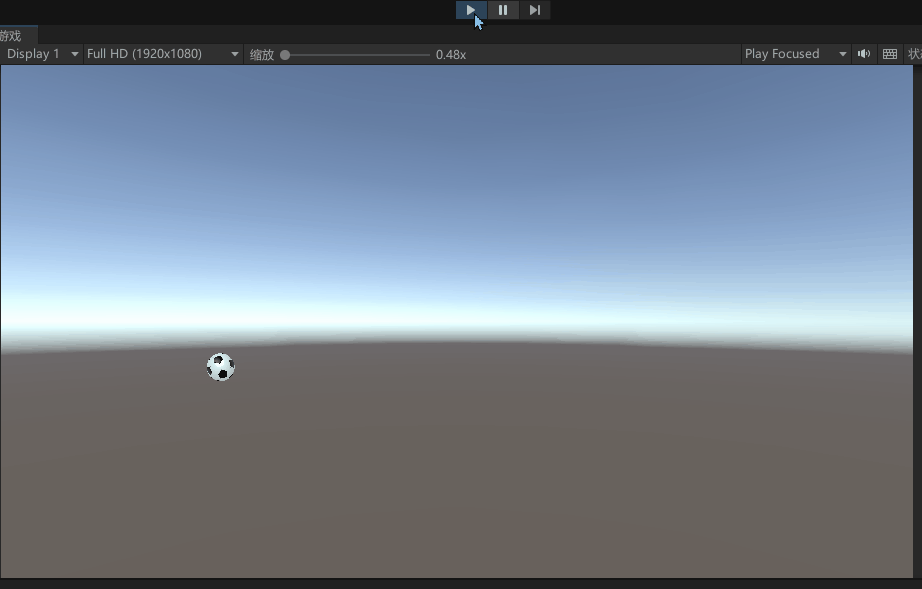
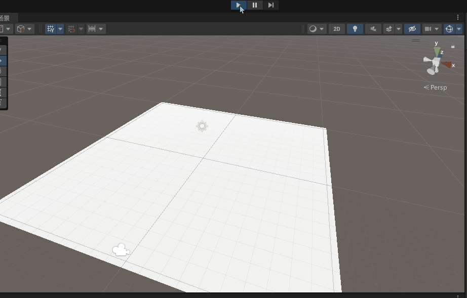
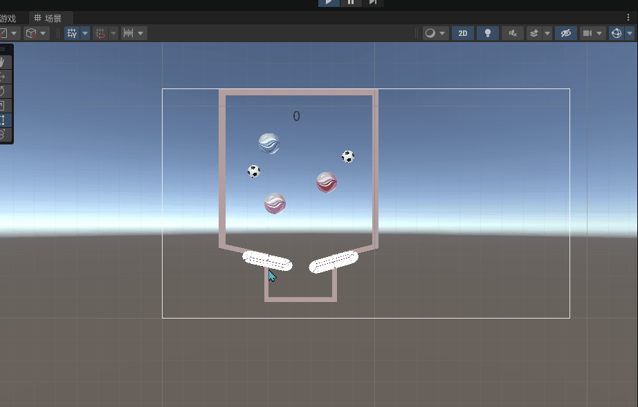

# physic-playground

> my_physic_learning_base_on_unity。  
基于unity的游戏物理案例合集。

## 案例一：
2d/3d football  

### 2d

### 3d

## 案例二：

点击如下链接：球与胶囊、墙壁碰撞等知识点。   
[lesson3](doc/lesson3/lesson3.md)   
[lesson4](doc/lesson4/lesson4.md)   

## 案例三：
todo
## 案例四：
todo
## 案例五：
todo