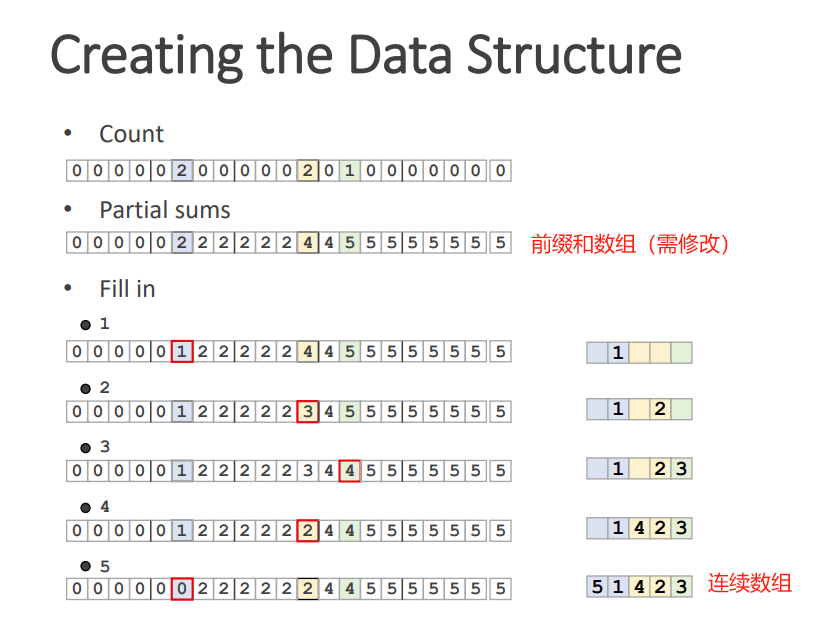

## 空间哈希（spatial hashing（SH））

### 将空间切割，可在o1时间复杂度内找到可能被碰撞的物体。

> 以下是一种省略链表的方法构建哈希数组。

1. 根据粒子数数组，构建前缀和数组。
2. 把粒子填入一个连续数组中。每次填入前缀和数组中减一。

使用时： 
1. 遍历前缀和数组，找到数组前后不同处（如上图0,2）
2. 根据（下标0-2），刚好从连续数组中取到粒子。

更新时：
1. 前缀和数组需要更新，连续数组需要更新。