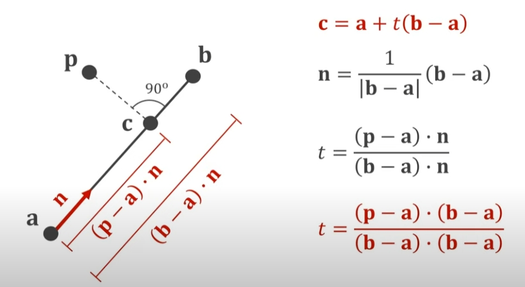
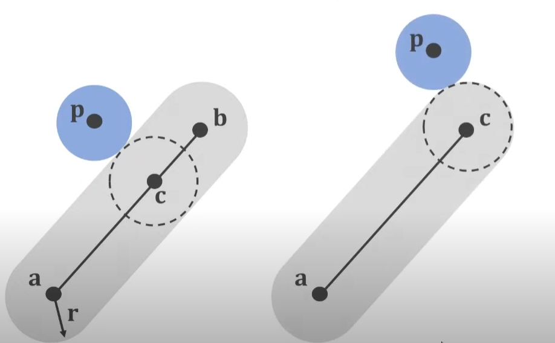
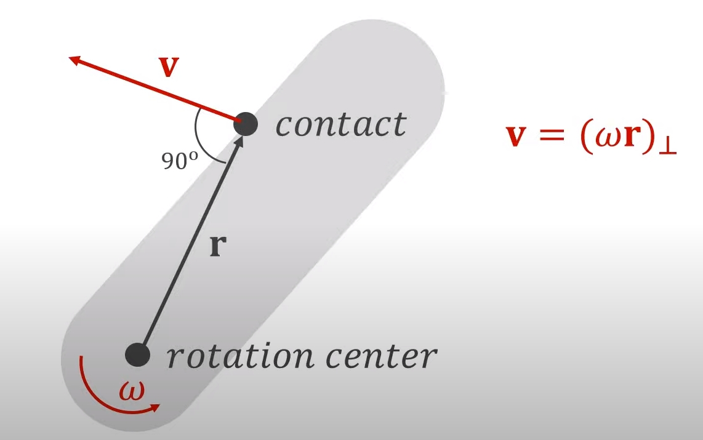
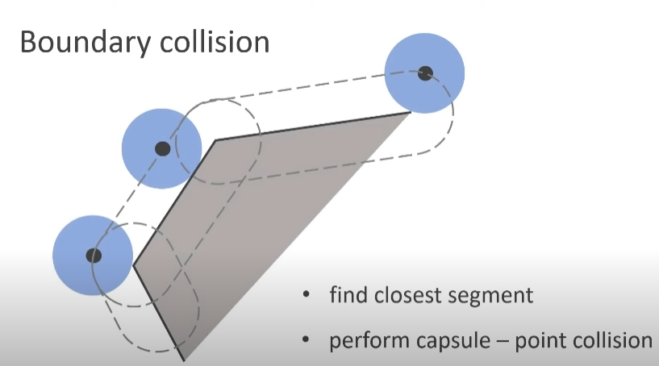
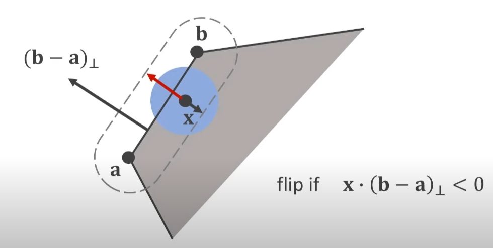

## 记录的知识点

### 1.求点到直线的最近点   

如图所示，设 t 为 a 点到 c点（所求） 的比例（ab）。   
则 c = a + t * (ab)   

### 2.球与胶囊体碰撞（即翘板和球的碰撞）

- 利用1求得球到胶囊体最近点。   
- 判断距离是否发生碰撞。
- 更新位置（沿着cp方向把球顶出去）   

- 更新速度，方向为 r 方向。
### 3. 球和墙壁碰撞。

- 同样利用1的方法找到球离墙壁的哪个点比较近。
- 执行 点 与 胶囊体 碰撞方法。    

- 如果球穿透了墙壁，要注意更新位置的方向。
