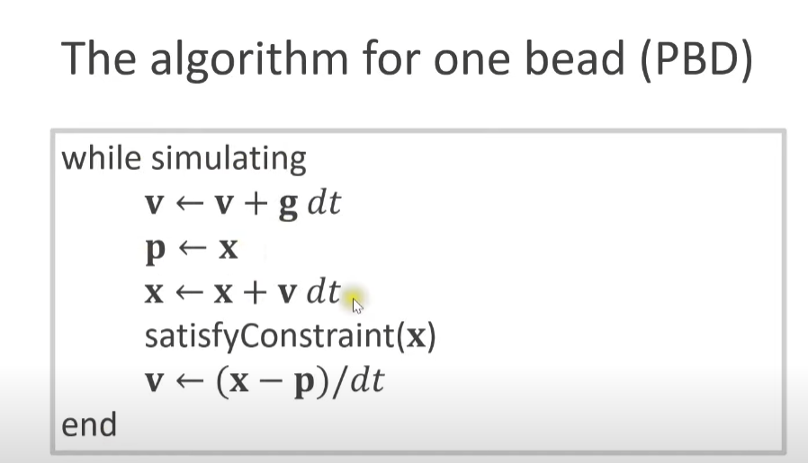
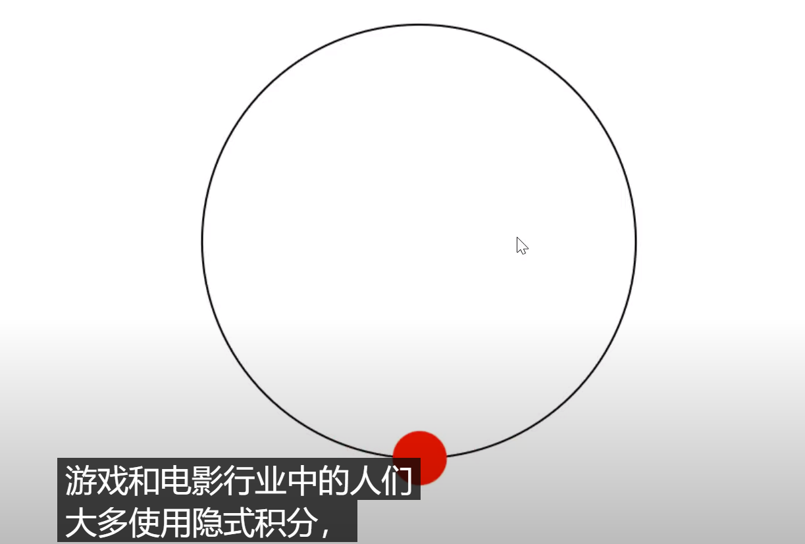

### 约束动力学

有多种方法求解约束，此处省去，直接记录最简单方式。
*** 
   

**PBD(基于位置的动力学)**    
> 整体思路： 
>   - 根据合外力加速度a，正常更新速度V_old。
>   - 记录旧的位置P_old, 使用旧的速度V_old更新P_old。
>   - 求解约束（核心）, 解算出新的位置P_new。
>   - 用新位置P_new更新新的速度V_new。

案例以点的距离约束为例, 约束求解阶段，需要对位置沿着球心方向修正。

> 可以看到，模拟中使用了隐式积分，导致有高度阻尼的现象。   

可以通过增加迭代精细度降低这种影响。即将dt分割成更小的步长。   

***   

> 本案例使用了自定义Image类的方式，画出界面上的圆环。具体做法见DrawCircle.cs。