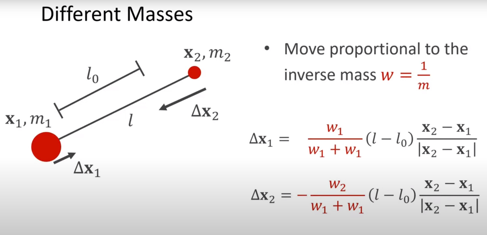

### 要点

1. 在尝试的过程中，遇到了球的径向速度消失的问题，没有第一时间察觉到，菜了。 造成问题的原因是，prePos赋初值时错误的使用了pos数组，这是个引用。

2. 同理lesson5，可以控制substep的次数，来控制模拟过程中的能量损耗，substep越大，越不会损耗能量。

3. 球体质量影响位移比重，用质量倒数表示比重，越重位移影响越小。（勘误）图中公式应为 w1 + w2。    

4. 本案例用了正交相机，canvas（屏幕空间-覆盖）。以适应linerender的渲染。