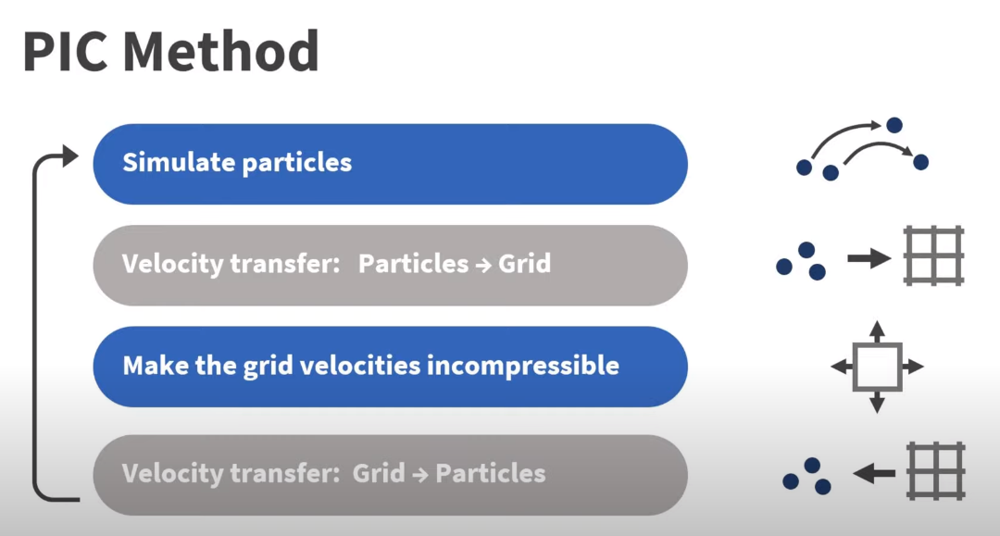
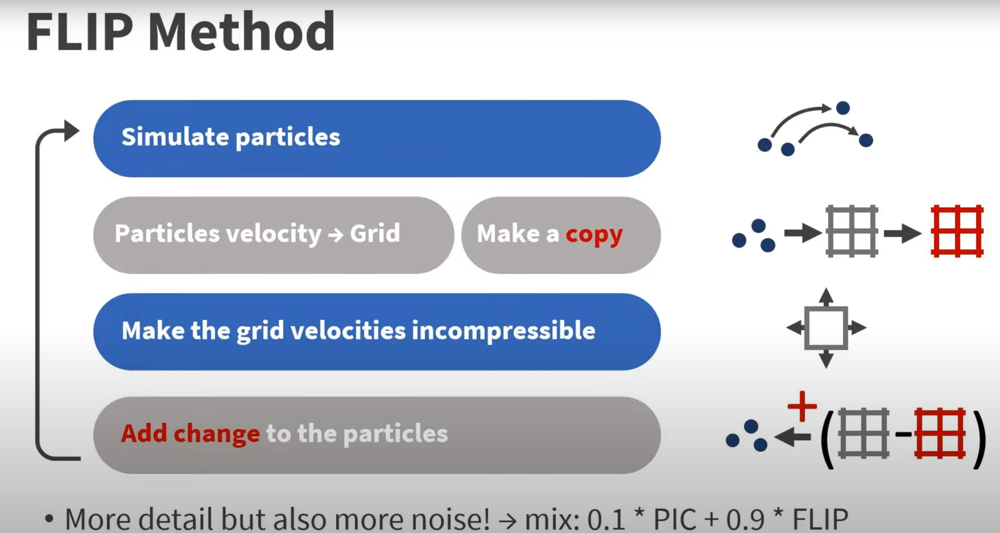

## 记录

> 在流体模拟中，"flip" 和 "Euler" 是两种常用的数值模拟方法。
>
> **FLIP 方法（Fluid-Implicit Particle）**：FLIP 方法是一种基于粒子的流体模拟方法。它结合了 Euler 方法和基于粒子的 Lagrangian 方法。FLIP 方法使用 Euler 方法来模拟流体的大规模行为，如速度场的演化，而使用基于粒子的 Lagrangian 方法来模拟流体的小规模行为，如表面细节和湍流效应。FLIP 方法通过在 Euler 方法的基础上引入粒子来改善模拟结果，从而更准确地模拟流体的行为。
>
> **Euler 方法**：Euler 方法是一种常见的数值模拟方法，用于解决流体动力学方程。它基于空间网格上的离散化，并使用差分方程来近似连续的流体方程。Euler 方法通过在每个时间步长上更新速度和位置来模拟流体的行为。然而，Euler 方法可能会导致数值耗散、数值扩散和较大的数值误差，特别是在模拟高速流体和大涡运动时。
>
> **PIC 方法（Particle-in-Cell）**：PIC 方法是一种基于网格的流体模拟方法。它使用网格来表示流体的物理属性，例如速度和密度，而粒子则用于跟踪流体的运动。在 PIC 方法中，流体的速度和密度通过插值粒子属性到网格上来更新。这样可以利用网格的性质进行数值计算，如通过求解网格上的流体动力学方程来模拟流体的行为。PIC 方法在处理流体的宏观行为上表现较好，例如大范围的流体运动和湍流效应。

### 解算器步骤 
1. 计算外力积分（重力等）。
2. - 使粒子分开（apart）；
    - 处理粒子碰撞（墙碰撞，障碍碰撞）
3. 将粒子速度转移到网格上。
4. 更新粒子密度，处理不可压缩（Incompressibility）约束
    - flip（在copy网格上求解约束，并用该值更新网格），会导致求解数值噪声较大。
    - pic 直接在网格上求解约束，会引来数值粘度问题。
    - 解决方法是0.1的pic， 0.9的flip，两种方法混合。
5. 将网格上的速度转移回到粒子上。

